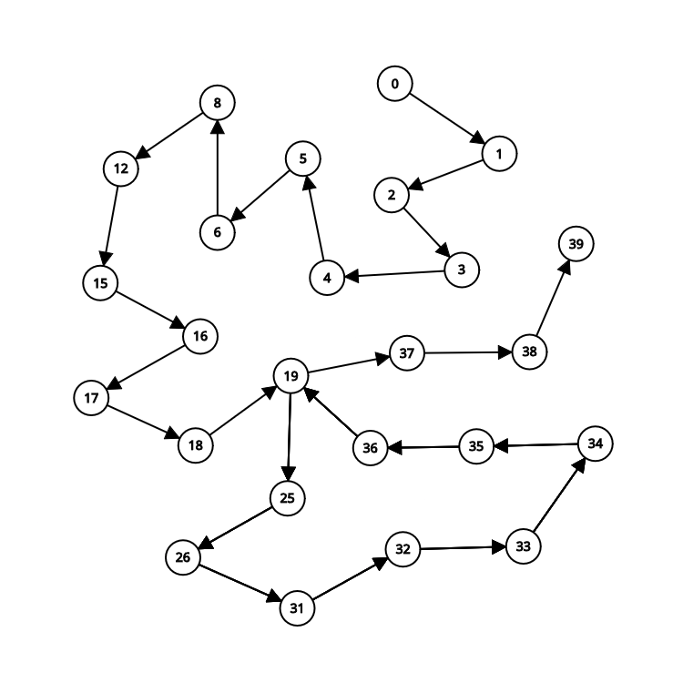

# 1. FPAA-trabalho-individual-02 - MaxMin Select

O **MaxMin Select** é um algoritmo que encontra simultaneamente o maior e o menor elemento em um array com o mínimo de comparações possível. Este projeto demonstra uma implementação eficiente que reduz o número total de comparações em relação à abordagem ingênua.

## Descrição do Algoritmo

O algoritmo `max_min_select` opera da seguinte forma:

1. **Tratamento de casos especiais**:
   - Se o array estiver vazio (`n == 0`), retorna `None`
   - Se o array tiver apenas um elemento (`n == 1`), retorna esse elemento como ambos máximo e mínimo

2. **Inicialização**:
   - Compara os dois primeiros elementos para definir os valores iniciais de `max` e `min`

3. **Processamento principal**:
   - Percorre o array em pares de elementos
   - Para cada par, compara:
     1. Os elementos entre si (1 comparação)
     2. O maior do par com o `max` atual (1 comparação)
     3. O menor do par com o `min` atual (1 comparação)
   - Totalizando 3 comparações para cada 2 elementos

4. **Tratamento de array com tamanho ímpar**:
   - Se o tamanho do array for ímpar, o último elemento é comparado separadamente com `max` e `min`

## Como Executar o Projeto

### Executar os testes com Docker:
Executa os testes unitários em **containeres de Rust e Python**
```sh
sudo docker compose up --build -d
```

### Executar os testes localmente:
```sh
./test.sh
```

### 1. Acessar o Diretório do Projeto  
```sh
cd selecao_simultanea_python
```

### 2. Criar e Ativar um Ambiente Virtual Python

Crie um ambiente virtual:  
```sh
python3 -m venv venv
```  
Ative o ambiente virtual:  

```sh
source venv/bin/activate
```  

### 3. Instalar as Dependências  
```sh
pip install -r requirements.txt
```

### 4. Executar o Projeto  
```sh
python3 main.py
```

O programa executará a função `main()` que demonstra o algoritmo com um array de exemplo [0,1,2,3,4,5,6,7,8,9]

## Relatório Técnico

### Análise da Complexidade Assintótica (Método de Contagem de Operações)

O algoritmo realiza:

1. **Caso base**:
   - 0 comparações para array vazio
   - 0 comparações para array com 1 elemento

2. **Inicialização**:
   - 1 comparação para os dois primeiros elementos

3. **Loop principal**:
   - Para cada par de elementos (⌊n/2⌋ - 1 pares):
     - 3 comparações por par
   - Total: 3*(⌊n/2⌋ - 1) comparações

4. **Elemento ímpar**:
   - 2 comparações adicionais se n for ímpar

**Total de comparações**:
- Melhor caso: 3n/2 - 2 comparações
- Pior caso: 3n/2 - 2 comparações

Isso resulta em uma complexidade linear O(n), significativamente melhor que a abordagem ingênua que requer 2n-2 comparações.

### Análise pelo Teorema Mestre

A recorrência do algoritmo pode ser expressa como:
T(n) = 2T(n/2) + O(1)

1. **Identificação dos parâmetros**:
   - a = 2 (número de subproblemas)
   - b = 2 (fator de divisão)
   - f(n) = O(1) (custo para combinar os resultados)

2. **Cálculo de log_b a**:
   - log₂ 2 = 1 → p = 1

3. **Caso do Teorema Mestre**:
   - f(n) = O(1) = O(n^(log_b a - ε)) para ε = 1
   - Portanto, cai no **Caso 1** do Teorema Mestre

4. **Solução assintótica**:
   - Como log_b a = 1 e f(n) = O(n^0), temos T(n) = Θ(n^(log_b a)) = Θ(n)

## Grafo:



### Tabela de Mapeamento:

| Vértice | Linha do Código | Instrução/Chamada |
|---------|-----------------|-------------------|
| 0       | def main():     | Início de main    |
| 1       | print(...)      | Chamada max_min_select |
| 2       | def max_min_select(...) | Início da função |
| 3       | n = len(array)  | Atribuição de n   |
| 4       | max = 0         | Inicialização max |
| 5       | min = 0         | Inicialização min |
| 6       | if n == 0:      | Verificação n == 0 |
| 7       | return None     | Retorno None      |
| 8       | if n == 1:      | Verificação n == 1 |
| 9       | max = array[0]  | Atribuição max    |
| 10      | min = array[0]  | Atribuição min    |
| 11      | return (max, min) | Retorno tuple    |
| 12      | if array[0] > array[1]: | Comparação inicial |
| 13      | max = array[0]  | Atribuição max    |
| 14      | min = array[1]  | Atribuição min    |
| 15      | else:           | Else da comparação |
| 16      | max = array[1]  | Atribuição max    |
| 17      | min = array[0]  | Atribuição min    |
| 18      | i = 2           | Inicialização i   |
| 19      | while i < (n-1): | Início do loop    |
| 20      | if i == n - 1:  | Verificação final |
| 21      | if array[i] > max: | Comparação max   |
| 22      | max = array[i]  | Atribuição max    |
| 23      | elif array[i] < min: | Comparação min |
| 24      | min = array[i]  | Atribuição min    |
| 25      | else:           | Else do loop      |
| 26      | if array[i] > array[i+1]: | Comparação par |
| 27      | if array[i] > max: | Comparação max   |
| 28      | max = array[i]  | Atribuição max    |
| 29      | if array[i+1] < min: | Comparação min |
| 30      | min = array[i+1] | Atribuição min    |
| 31      | else:           | Else da comparação par |
| 32      | if array[i+1] > max: | Comparação max   |
| 33      | max = array[i+1] | Atribuição max    |
| 34      | if array[i] < min: | Comparação min   |
| 35      | min = array[i]  | Atribuição min    |
| 36      | i += 1          | Incremento i      |
| 37      | return (max, min) | Retorno final    |
| 38      | print(...)      | Execução do print |
| 39      | fim             | Fim da execução   |