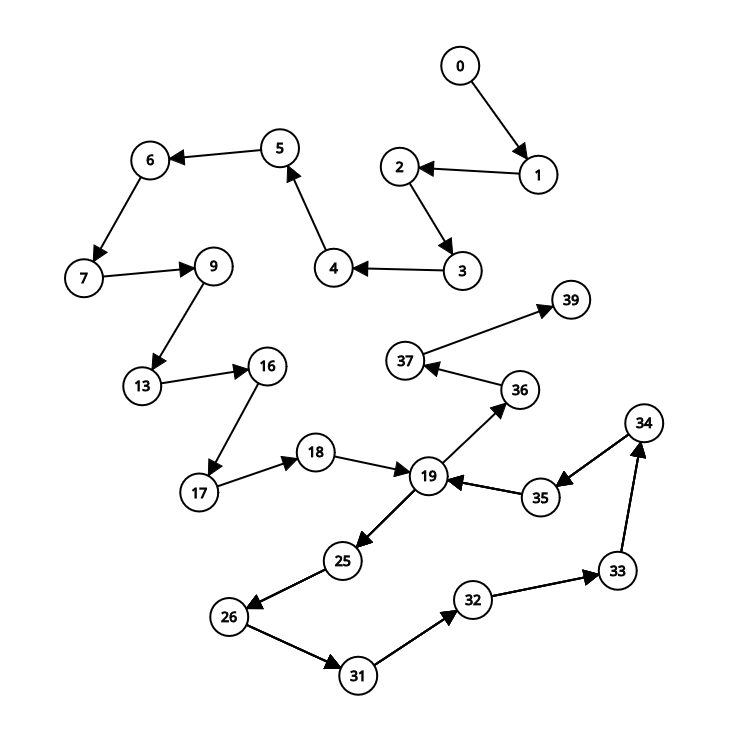

# 1. FPAA-trabalho-individual-02

O **MaxMin Select**, dessa vez implementado em Rust que encontra simultaneamente o maior e o menor elemento em um vetor (`Vec<i64>`) com o mínimo de comparações possível. Esta implementação demonstra os princípios de eficiência e segurança de tipos da linguagem Rust.

## Como Executar o Projeto

3. Execute o projeto:
```bash
cargo run
```

4. A saída deverá ser:
```
Máximo: 9, Mínimo: 0
```

5. Execute os testes:
```bash
cargo test
```

## Relatório Técnico

### Análise da Complexidade Assintótica (Método de Contagem de Operações)

O algoritmo em Rust mantém a mesma eficiência que a versão Python:

1. **Caso base**:
   - 0 comparações para vetor vazio
   - 0 comparações para vetor com 1 elemento

2. **Inicialização**:
   - 1 comparação para os dois primeiros elementos

3. **Loop principal**:
   - Para cada par de elementos (⌊n/2⌋ - 1 pares):
     - 3 comparações por par
   - Total: 3*(⌊n/2⌋ - 1) comparações

4. **Elemento ímpar**:
   - 2 comparações adicionais se n for ímpar

**Total de comparações**:
- Melhor caso: 3n/2 - 2 comparações
- Pior caso: 3n/2 - 2 comparações

Complexidade linear O(n), idêntica à versão Python, porém com todas as vantagens de desempenho do Rust.

### Análise pelo Teorema Mestre

A recorrência do algoritmo permanece a mesma:
T(n) = 2T(n/2) + O(1)

1. **Identificação dos parâmetros**:
   - a = 2 (número de subproblemas)
   - b = 2 (fator de divisão)
   - f(n) = O(1) (custo para combinar os resultados)

2. **Cálculo de log_b a**:
   - log₂ 2 = 1 → p = 1

3. **Caso do Teorema Mestre**:
   - f(n) = O(1) = O(n^(log_b a - ε)) para ε = 1
   - Portanto, cai no **Caso 1** do Teorema Mestre

4. **Solução assintótica**:
   - T(n) = Θ(n^(log_b a)) = Θ(n)

## Diferenças Notáveis na Implementação Rust

1. **Sistema de Tipos**:
   - Uso explícito de `i64` para todos os valores
   - Retorno encapsulado em `Option<(i64, i64)>` para tratamento seguro de vetores vazios

2. **Segurança de Memória**:
   - Acesso seguro aos elementos do vetor garantido pelo compilador
   - Nenhuma possibilidade de acesso inválido à memória

3. **Performance**:
   - Compilação para código nativo
   - Sem overhead de runtime

4. **Padrões de Codificação**:
   - Uso de `match` para tratamento do resultado
   - Convenções de nomenclatura Rust (snake_case para funções)

   ## Grafo:
   
   

   ### **Tabela de Mapeamento (Rust)**

| Vértice | Linha do Código | Instrução/Chamada |
|---------|-----------------|-------------------|
| 0       | `fn main()`     | Início de `main`  |
| 1       | `let array = ...` | Criação do vetor |
| 2       | `match max_min_select(array)` | Chamada da função |
| 3       | `fn max_min_select(...)` | Início da função |
| 4       | `let n = array.len()` | Calcula tamanho |
| 5       | `let mut min;`  | Declara `min`     |
| 6       | `let mut max;`  | Declara `max`     |
| 7       | `if n == 0`     | Verifica se está vazio |
| 8       | `return None`   | Retorna `None`    |
| 9       | `if n == 1`     | Verifica tamanho 1 |
| 10      | `min = array[0]` | Atribui `min`    |
| 11      | `max = array[0]` | Atribui `max`    |
| 12      | `return Some((max, min))` | Retorna valores |
| 13      | `if array[0] > array[1]` | Compara primeiros elementos |
| 14      | `max = array[0]` | Atribui `max`    |
| 15      | `min = array[1]` | Atribui `min`    |
| 16      | `else`          | Caso contrário   |
| 17      | `max = array[1]` | Atribui `max`    |
| 18      | `min = array[0]` | Atribui `min`    |
| 19      | `for i in 2..(n - 1)` | Início do loop |
| 20      | `if i == (n - 1)` | Verifica último elemento |
| 21      | `if array[i] > max` | Compara com `max` |
| 22      | `max = array[i]` | Atualiza `max`   |
| 23      | `else if array[i] < min` | Compara com `min` |
| 24      | `min = array[i]` | Atualiza `min`   |
| 25      | `else`          | Caso par de elementos |
| 26      | `if array[i] > array[i + 1]` | Compara elementos adjacentes |
| 27      | `if array[i] > max` | Verifica `max`   |
| 28      | `max = array[i]` | Atualiza `max`   |
| 29      | `if array[i + 1] < min` | Verifica `min`   |
| 30      | `min = array[i + 1]` | Atualiza `min`   |
| 31      | `else`          | Caso contrário   |
| 32      | `if array[i + 1] > max` | Verifica `max`   |
| 33      | `max = array[i + 1]` | Atualiza `max`   |
| 34      | `if array[i] < min` | Verifica `min`   |
| 35      | `min = array[i]` | Atualiza `min`   |
| 36      | `return Some((max, min))` | Retorno final |
| 37      | `Some((max, min)) => println!(...)` | Saída do resultado |
| 38      | `None => println!(...)` | Tratamento de erro |
| 39      | Fim da execução | Programa termina |